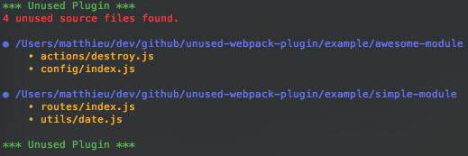

# UnusedWebpackPlugin [](https://circleci.com/gh/MatthieuLemoine/unused-webpack-plugin)

A webpack plugin to find unused modules/source files.


## Install

```
npm i --dev unused-webpack-plugin
```

## Usage

```javascript
const path = require('path');
const UnusedWebpackPlugin = require('unused-webpack-plugin');

module.exports = {
  // webpack configuration
  plugins: [
    ...otherPlugins,
    new UnusedWebpackPlugin({
      // Source directories
      directories: [path.join(__dirname, 'src')],
      // Exclude patterns
      exclude: ['*.test.js'],
      // Root directory (optional)
      root: __dirname,
    }),
  ],
};
```

## Options

- `directories` : array of directories where to look for unused source files.
- `exclude` : array of exclude patterns when looking for unused source files.
- `root` : root directory that will be use to display relative paths instead of absolute ones (see below)
- `failOnUnused`: whether or not the build should fail if unused files are found (defaults to `false`)
- `useGitIgnore`: whether or not to respect `.gitignore` file (defaults to `true`)

With root


Without root



## Related

If you're not using webpack, check out [remnants](https://github.com/MatthieuLemoine/remnants).
